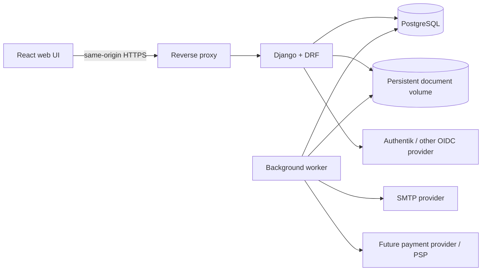
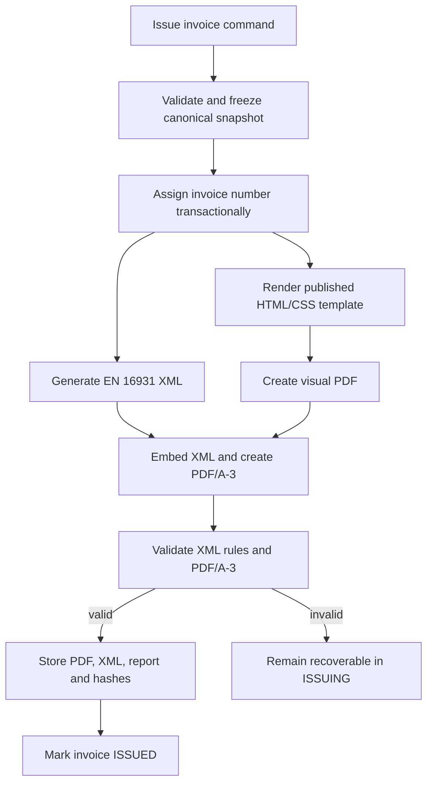

# Pinaks — Target Architecture

Status: accepted architecture baseline  
Product name: Pinaks  
Jurisdiction: Germany  
Deployment model: one installation for one company  

## 1. Purpose

Pinaks is the API-first successor to Numus: an invoicing and customer-information application. It is generic enough to serve different single-company invoicing use cases without making legally significant invoice behavior arbitrary or programmable.

The name **Pinaks** is derived from the Ancient Greek *pinax*—a tablet, board or register—with the final **k** chosen as part of the project's identity.

The design deliberately favors a small number of conventional, well-supported components:

- Django modular monolith
- Django REST Framework API
- PostgreSQL database
- Same-origin React and TypeScript web application
- Multilingual user interface and business documents
- Django sessions and CSRF protection
- Versioned HTML/CSS document templates
- ZUGFeRD PDF/A-3 invoices with embedded EN 16931 XML
- Local persistent document storage
- Database-backed background work and email outbox

This document describes the target structure and its invariants. It does not prescribe an implementation sequence.

## 2. Architectural principles

1. **The API is the application boundary.** The browser UI, administrative screens and future integrations invoke the same explicit application operations.
2. **One deployment represents one company.** There is no tenant or organization key on business records.
3. **Issued documents are immutable evidence.** Historical invoices never depend on mutable customer, company, template or configuration data.
4. **Structured invoice data is canonical.** The visual PDF and embedded e-invoice XML are projections of the same issued invoice snapshot.
5. **Configuration is constrained data, not executable behavior.** Tax profiles, custom fields, templates and feature flags are configurable; core accounting invariants are code-defined.
6. **Extensibility comes from module boundaries.** The application does not expose a plugin framework. Optional capabilities are activated through code-defined feature flags.
7. **The database protects important invariants.** Uniqueness, referential integrity, numeric precision and immutable issuance records are not left solely to UI validation.
8. **External providers are adapters.** Authentication, email and future payments do not leak provider-specific concepts into billing.
9. **Language is explicit context.** UI language, customer preference and issued-document language are separate, persisted decisions; translated text is never inferred from the deployment host.

## 3. System context



The reverse proxy exposes a single application origin:

- `/app/` — React UI
- `/api/v1/` — product API
- `/accounts/` — local and external authentication flows
- `/admin/` — restricted Django administration

The browser never stores OAuth access tokens. After an external login, Django creates the same server-side session used for local login.

## 4. Technology baseline

| Concern | Decision |
|---|---|
| Backend | Django 6.1 initially, moving to Django 6.2 LTS |
| API | Django REST Framework with generated OpenAPI schema |
| Database | PostgreSQL |
| Frontend | React with TypeScript |
| UI system | shadcn/ui source components, Base UI primitives and Tailwind CSS |
| Server-state UI | TanStack Query |
| Forms | React Hook Form with schema-based client validation |
| Frontend localization | i18next with react-i18next |
| Backend localization | Django gettext and locale middleware |
| Authentication | django-allauth; local accounts plus generic OIDC connections |
| PDF rendering | Versioned HTML/CSS rendered through WeasyPrint |
| E-invoice | ZUGFeRD/Factur-X, EN 16931 profile, PDF/A-3 plus embedded XML |
| Email | SMTP through an internal `EmailSender` boundary |
| Background work | Database-backed worker and outbox; no broker required initially |
| File storage | Django storage abstraction backed by a local persistent volume |

Django 6.1 is a suitable greenfield starting point. The application should remain free of deprecations and move to Django 6.2 LTS after its early patch releases. This is a smaller transition than beginning on Django 5.2 and later crossing the Django 6 boundary.

## 5. Modular monolith

All modules run in one Django deployment and share one PostgreSQL database. Boundaries are enforced through public service functions, API contracts and ownership of models—not through network calls.

### `accounts`

Owns local users, roles, authentication policy and provider connections. django-allauth owns the low-level local and social-account records.

### `configuration`

Owns the singleton company profile, invoice numbering policy, locale, currency defaults, tax profiles, enabled capabilities and non-secret provider configuration.

### `customers`

Owns customers, addresses, contact data and reusable billing-recipient details.

### `catalog`

Owns reusable goods and service definitions. This replaces the use-case-specific `Symptom` concept with a generic catalog item while retaining an external/code identifier, description and default pricing information.

### `billing`

Owns invoices, invoice lines, totals, lifecycle transitions, payment state, corrections, reusable invoice presets and invoice numbering.

### `custom_fields`

Owns custom-field definitions, validation and query behavior for explicitly supported entity types.

### `documents`

Owns visual template versions, preview rendering, issued document records, stored artifacts and hashes.

### `e_invoicing`

Owns the mapping from an issued invoice snapshot to EN 16931 data, ZUGFeRD packaging and conformance validation. It depends on billing snapshots; billing does not depend on a particular e-invoice library.

### `notifications`

Owns email templates, outgoing messages, attachment references, delivery attempts and the `EmailSender` adapter.

### `payments`

Initially exposes only provider-neutral payment operations. It is the future home of payment requests, provider callbacks and Wero/PSP adapters without adding provider fields to invoices.

### `audit`

Owns security and business audit events. It is not an event-sourcing mechanism and is not used to reconstruct ordinary application state.

### `legacy_import`

Owns staging records, source identifiers, transformation decisions and reconciliation reports for the Java/Derby migration. It is isolated from normal runtime workflows.

## 6. Core domain model

### 6.1 Company configuration

`CompanyProfile` is a singleton for the installation. It contains the current company identity and defaults, including:

- Legal name and addresses
- Contact details
- Tax and company identifiers
- Bank/payment instructions
- Default currency and locale
- Default UI and business-document languages
- Active tax profile
- Default document and email templates
- Invoice numbering policy

Secrets such as SMTP passwords and OIDC client secrets are not stored as ordinary configuration values. They are supplied through the deployment's secret mechanism.

Changing `CompanyProfile` affects future drafts only. Issued invoices contain a seller snapshot.

### 6.2 Customers and recipients

`Customer` represents the person or organization receiving the service and owning the commercial history. It supports both natural persons and legal entities without assuming a medical use case.

Core customer information includes:

- Customer number
- Person or organization type
- Names and display/legal name
- Email and phone contact data
- One or more addresses
- Active/archived state
- Custom data
- Preferred correspondence/document language

`BillingRecipient` is reusable recipient information associated with a customer. It may contain a different person or organization and address.

An invoice always distinguishes:

- `customer` — the service/customer relationship
- `recipient` — where and to whom the invoice is addressed
- future payment source — who actually initiated payment

During draft editing, recipient information may be copied from the customer, a saved alternate recipient, another known customer or manually supplied data. Issuance stores an immutable recipient snapshot. The saved source may subsequently change without affecting the invoice.

### 6.3 Catalog and invoice presets

`CatalogItem` is reusable source data for an invoice line:

- Stable code
- Description
- Default unit
- Default price
- Default tax treatment
- Optional minimum/maximum advisory price
- Custom data
- Active/archived state

Selecting a catalog item copies its current values into a draft line. An invoice line never depends on later catalog edits.

`InvoicePreset` is a reusable collection of draft line defaults and optional custom values. It is distinct from a `DocumentTemplate`, which controls visual PDF layout. This separation replaces the old `BillTemplate` concept without conflating billing content and document presentation.

### 6.4 Invoice aggregate

`Invoice` is the transactional boundary for invoice editing and issuance. Its strongly modeled fields include:

- Internal immutable identifier
- Invoice type
- Lifecycle status
- Payment status
- Customer reference
- Issue and due dates
- Currency
- Document language
- Invoice number after issuance
- Seller, customer and recipient snapshots after issuance
- Subtotal, tax totals and grand total
- Correction/original-document relationship
- Custom data
- Concurrency version
- Created, modified and issued audit information

`InvoiceLine` includes:

- Stable ordering
- Optional catalog source reference
- Service/delivery date or period
- Item code and description snapshots
- Quantity and unit
- Unit price
- Discount, if used
- Tax category and rate
- Tax exemption reason code/text when applicable
- Calculated net, tax and gross totals
- Custom data

All quantities and monetary values use decimal database types. Floating-point arithmetic is prohibited for billing calculations. The backend owns calculations and rounding; the UI may display estimates but never supplies authoritative totals.

### 6.5 Invoice lifecycle

The lifecycle and payment state are independent:

```text
Invoice lifecycle: DRAFT -> ISSUING -> ISSUED -> CANCELLED
Payment state:     UNPAID | PAID
```

`OVERDUE` is derived from due date, payment state and current date rather than persisted as a competing lifecycle state.

Key invariants:

- Drafts are editable and do not require a legal invoice number.
- Invoice numbers are assigned transactionally at issuance.
- `ISSUING` makes retries idempotent and prevents a half-generated document from appearing issued.
- Issued invoices and lines are immutable.
- Payment status may change without changing invoice content.
- Cancelling or correcting an invoice creates legally traceable document relationships; it never rewrites the original.
- Concurrent draft updates require the expected version and fail rather than silently overwrite another browser session.

### 6.6 Corrections

Correction documents reference the original invoice and carry an explicit reason. The domain supports cancellation invoices, credit notes and corrected replacement invoices without treating any of them as edits.

Both the human-readable document and structured e-invoice data contain the relevant reference. The exact document type and reason are part of the issued snapshot.

## 7. German tax configuration

Tax treatment is configurable through validated `TaxProfile` records rather than hard-coded for the initial company.

A profile defines:

- Tax category
- Default tax rate
- Exemption reason code, where applicable
- Default human-readable exemption wording
- Net or gross price-entry policy
- Visual tax-column policy
- Required seller tax identifiers

Lines may override the profile where business rules permit. Even when the visual template hides tax columns, the canonical invoice retains the tax category, rate and exemption semantics needed by structured e-invoicing.

The accountant's future determination changes configuration, not architecture. Published invoices retain the exact tax profile snapshot used when issued.

The system is not a general tax engine. It supports explicitly modeled German invoice treatments and rejects combinations that cannot produce a valid invoice.

## 8. E-invoice and document architecture

Germany treats structured invoice data—not a plain PDF—as the e-invoice. The standard issued artifact is therefore a ZUGFeRD PDF/A-3 document using the EN 16931 profile.



### Canonical snapshot

One immutable snapshot is the source for both representations. It includes:

- Seller identity
- Customer and recipient identity
- Dates and invoice identifiers
- Every line and custom value used on the document
- Tax categories, rates and exemption reasons
- All calculated totals
- Payment instructions
- Applicable template and tax-profile versions

Visual templates cannot override canonical totals or inject different structured values.

### Stored issued artifacts

Each issued document record contains or references:

- Final PDF/A-3 file
- Exact embedded XML as a separately retrievable artifact
- E-invoice standard, profile and specification version
- Template version
- Validator identity/version and validation report
- Cryptographic hashes
- Generation timestamp

Artifacts are never regenerated to answer a historical request. The originally issued bytes are returned.

### Renderer and validator boundaries

`VisualDocumentRenderer`, `EInvoiceSerializer`, `HybridPdfPackager` and `EInvoiceValidator` are small internal interfaces. They isolate external libraries and tools from the billing domain. A well-supported command-line validator can run inside the same deployment if the Python library ecosystem does not provide equivalent conformance; this does not require a separate service.

## 9. Document template design

Administrators may edit raw HTML and CSS. Templates use a constrained template language with an allowlisted context and formatting filters.

`DocumentTemplate` identifies a logical template. `DocumentTemplateVersion` contains:

- Draft or published state
- HTML source
- CSS source
- Asset references
- Declared page settings
- Language
- Creation and publication audit data

Rules:

- Published versions are immutable.
- Editing a published template creates a new draft version.
- Preview may use safe sample data or a selected draft invoice.
- Rendering has no arbitrary Python execution.
- Remote network access and arbitrary filesystem access are disabled.
- Assets are resolved from controlled storage.
- Only published versions may issue invoices.
- Template failures cannot result in an issued invoice without a valid document.
- A published version belongs to one language. Missing translations fall back only according to explicit installation policy; issuing never silently mixes languages within one document.

The preview is explicitly non-authoritative. Final issuance always revalidates the invoice and renders from the frozen snapshot.

## 10. Custom fields and search

Custom fields are supported initially on:

- Customers
- Catalog items
- Invoices
- Invoice lines

`CustomFieldDefinition` contains:

- Immutable machine key
- Editable label and help text
- Localized labels and help text
- Target entity type
- Data type
- Required/default rules
- Choice values or type-specific validation
- Display order
- Document visibility
- Search mode: none, exact, range or text
- Sensitive-data marker
- Active/retired state

Supported types are finite and code-defined, such as text, long text, integer, decimal, boolean, date and choice. Custom executable expressions are not supported.

Values are stored in an entity's JSONB `custom_data`, while core billing fields remain relational columns. Backend validation is authoritative. A used definition is retired rather than deleted, and issued invoice snapshots retain the definition label, type and value used at issuance.

Search uses PostgreSQL rather than a separate search service:

- JSONB GIN indexing for exact/choice/boolean queries
- PostgreSQL text search for fields marked as textual search targets
- Typed expressions for numeric and date ranges
- Targeted expression indexes only for demonstrated high-volume fields

A field such as diagnosis is marked sensitive. Sensitive fields are excluded from application logs and broad exports by default, remain subject to role checks and create audit records when accessed through sensitive-data workflows.

## 11. Authentication and authorization

### Canonical account model

Every person has one local Django user. That user may have:

- A usable local password
- No local password
- One or more external identities connected through django-allauth

External identities are keyed by provider identity—OIDC issuer/provider plus subject—not by mutable email address.

### Authentication flows

- Local credentials create a normal Django session.
- Authentik uses the OIDC authorization-code flow and returns control to Django.
- A successful permitted Authentik login with no corresponding account may create a local user with the `Read-Only` role.
- Admission is controlled by Authentik group membership. The application treats a successful Authentik response as already admitted.
- An existing authenticated local user can explicitly connect or disconnect external identities.
- An external identity is not automatically attached to an existing local user merely because email addresses match.
- Users may set a local password after external login.
- Administrators may create local users and assign temporary passwords that must be changed at next login.
- At least one protected local administrator exists independently of external providers.
- Removing an Authentik identity or group membership does not disable the canonical local user. A local administrator controls local account activation.

The browser receives only an HTTP-only session cookie and CSRF token. OAuth tokens are not exposed to React and are not retained unless a future provider integration needs them for an explicit API purpose.

### Roles

Authorization is backend-enforced and role-based. The initial roles are:

| Capability | Admin | Company Member | Read-Only |
|---|:---:|:---:|:---:|
| View customers, invoices and documents | Yes | Yes | Yes |
| Create/edit customers and drafts | Yes | Yes | No |
| Issue, correct and cancel invoices | Yes | Yes | No |
| Change payment state | Yes | Yes | No |
| Send invoice email | Yes | Yes | No |
| Manage users and roles | Yes | No | No |
| Configure company/tax/numbering | Yes | No | No |
| Configure SMTP and providers | Yes | No | No |
| Edit/publish document templates | Yes | No | No |
| Manage custom-field definitions | Yes | No | No |
| Manage feature flags | Yes | No | No |

New Authentik-provisioned users receive `Read-Only`. Only an administrator can promote or demote them. Authentik groups do not continually overwrite application roles.

## 12. API architecture

The stable product boundary is versioned under `/api/v1`. OpenAPI describes request/response schemas and drives the generated TypeScript client.

Ordinary resources use conventional endpoints. Business transitions use explicit commands, for example:

```text
POST /api/v1/invoices
GET  /api/v1/invoices/{id}
PATCH /api/v1/invoices/{id}
POST /api/v1/invoices/{id}/issue
POST /api/v1/invoices/{id}/cancel
POST /api/v1/invoices/{id}/correct
POST /api/v1/invoices/{id}/mark-paid
POST /api/v1/invoices/{id}/send
POST /api/v1/document-templates/{id}/preview
POST /api/v1/account/connections/{provider}/connect
```

Important lifecycle operations are not expressed as arbitrary status-field patches.

API rules:

- Permissions are checked server-side for every operation.
- Draft mutations include an expected version for optimistic concurrency.
- Validation failures use structured field and business-rule errors.
- Error responses contain stable machine codes; localized messages are presentation text and are not API contracts.
- Long-running or retryable operations expose stable operation state.
- Pagination, filtering and ordering conventions are consistent across resources.
- Sensitive values are never returned merely because they happen to exist in JSONB.
- Internal ORM models are not exposed as an accidental public schema.

Django admin is an operational support surface, not the primary product UI and not an alternative API.

## 13. Frontend architecture

The React application is a same-origin API client organized by the same business capabilities as Django:

- Customers
- Catalog
- Billing
- Documents and templates
- Notifications
- Configuration
- Accounts

TanStack Query owns remote/server state. React Hook Form owns form state. Global client-state infrastructure is not introduced unless a real cross-feature client-only state problem appears.

The backend provides a `/capabilities` representation containing the authenticated role and enabled feature flags. The UI uses it for navigation and affordances, but the backend remains authoritative.

Authentication redirects and callbacks remain server-managed. The SPA does not implement token refresh, token storage or CORS workarounds.

### UI component system

The application uses shadcn/ui as an owned design-system starting point, not as a remotely controlled black-box component library. Selected components live in the application source tree and may be adapted behind stable local component APIs.

For a new application, the preferred primitive foundation is Base UI, which is the current shadcn/ui default. Tailwind CSS supplies design tokens and layout styling; Lucide supplies icons. The component layer must expose consistent application-level components for fields, dialogs, tables, destructive confirmations, status indicators and page structure rather than spreading one-off Tailwind compositions throughout feature code.

The supporting UI choices are:

- shadcn/ui with Base UI for accessible interactive primitives
- Tailwind CSS for token-driven styling
- Lucide for icons
- React Hook Form for form state
- Zod for convenient client-side schemas, without replacing backend validation
- TanStack Table for customer and invoice tables that require sorting, filtering, selection or column configuration
- TanStack Query for API/server state

Third-party shadcn registries are not trusted dependencies by default. Components are taken from the official registry, reviewed as application source and tested for accessibility. Base UI and shadcn handle much of the interaction foundation, but accessible names, error descriptions, focus behavior, contrast and keyboard workflows remain application responsibilities.

The visual style should remain restrained and information-dense: clear typography, strong table and form behavior, limited decorative cards and no dashboard UI added merely to fill space.

## 14. Internationalization and localization

Internationalization is present from the first release. English (`en`) and German (`de`) are complete initial languages; additional languages can be added without changing the data model or API.

### Separate language contexts

The system distinguishes:

1. **User-interface language** — stored per user, with browser preference and installation default as fallbacks.
2. **Customer correspondence preference** — stored on the customer and used as the default for new invoices and messages.
3. **Invoice document language** — explicitly stored on each invoice and frozen at issuance.
4. **Installation default language** — used only when no more specific preference exists.

Changing a user's UI language never changes an invoice's language. Changing a customer's preferred language affects future drafts only.

### Application strings

- React uses namespaced i18next resources through react-i18next.
- Django uses its gettext facilities for backend/admin strings and localized fallback messages.
- Translation keys are stable semantic identifiers rather than English prose used as database keys.
- Plurals and parameter interpolation use the language libraries' native mechanisms.
- Dates, numbers and currencies are formatted with locale-aware standard APIs; formatted strings are never persisted as authoritative values.
- Database enums and API values remain stable language-neutral codes.
- Layouts allow for translated text expansion and use logical start/end styling rather than assuming left/right placement unnecessarily.

### Business-authored translations

Business content has explicit localized variants where required:

- Document templates are versioned per language.
- Email templates are versioned per language.
- Tax/exemption wording can be configured per language.
- Custom-field labels, descriptions and choice labels are localizable while their machine keys and stored choice values remain stable.
- Catalog items may have localized descriptions; invoice issuance snapshots the selected wording.

The administration UI shows translation completeness and prevents publication where required content for that language is missing. Automatic machine translation is not part of the authoritative document workflow.

### API language behavior

API resources expose canonical values plus localized presentation only where useful. Business decisions never depend on parsing translated text. Requests select presentation language through the authenticated user preference, with standard language negotiation as a fallback.

Issued ZUGFeRD code values remain standards-based and language-neutral. Free-text descriptions and legal wording follow the invoice document language.

## 15. Email architecture

Billing never opens an SMTP connection directly. Sending creates an immutable `OutgoingEmail` snapshot containing:

- Recipient addresses
- Subject and body
- Referenced invoice/document and attachment hash
- Selected sender/provider
- Message language and email-template version
- Creation and scheduling time
- Delivery state

A worker claims outbox records and delegates to `EmailSender`. The initial implementation is SMTP. Future implementations may use Graph, Gmail or a transactional provider without changing invoice workflows.

Delivery attempts record timestamps, sanitized provider responses and errors. Retry behavior is idempotent and does not silently produce duplicate messages. SMTP credentials remain deployment secrets.

## 16. Payment architecture

The initial product records only `UNPAID` or `PAID`, the change time and the responsible user. Manual payment state is sufficient.

Billing exposes provider-neutral payment operations. It contains no Wero, PSP, checkout URL or webhook columns.

If online payments are enabled later, the `payments` module may add:

- `PaymentRequest`
- Provider and external identifiers
- Amount and currency
- Checkout URL or QR payload
- Provider-neutral status
- Expiry
- Idempotent `PaymentEvent` records
- Successful payment records

A Wero integration would be an adapter to the selected PSP/acquirer. Provider events call the same billing operation used by manual payment recording.

## 17. Storage and background processing

### Persistent files

The production deployment has a dedicated local persistent volume. Database records contain opaque storage keys, never trusted absolute paths.

Storage rules:

- Writes are atomic where possible.
- Issued artifacts are write-once.
- Hashes are checked when stored and may be checked during backup verification.
- Temporary preview artifacts are isolated and expire.
- Template uploads are content- and size-validated.
- Direct arbitrary file serving is prohibited; Django/reverse-proxy authorization controls access.

PostgreSQL and the document volume are backed up as one recoverable application dataset. Backups are encrypted, stored off the application host and periodically restored in a verification environment.

### Worker

One lightweight worker process handles retryable work such as:

- Issued-document generation and validation
- Email delivery
- Cleanup of temporary previews
- Future payment-provider events

The database provides the queue/outbox initially. Redis, Celery, RabbitMQ or Kafka are not architectural requirements.

## 18. Feature flags and extensibility

Feature flags are typed, code-defined capabilities with installation-level values. Examples might include payment requests, reminders or time tracking.

Rules:

- A flag can activate only behavior that exists in the deployed code.
- The backend is authoritative.
- Disabling a feature does not delete its data.
- Database tables and migrations may remain installed while a feature is disabled.
- Dependencies point inward toward stable billing/customer contracts.
- Optional modules interact through application services and documented events/outbox records, not direct mutation of another module's tables.

There is intentionally no runtime plugin loader, third-party extension ABI, dynamic Python import mechanism or separately deployed service topology. A future feature can become an internal Django app without changing the overall architecture.

## 19. Audit, privacy and security

Audit events cover at least:

- Successful and failed authentication where available
- Account connection/disconnection
- User activation and role changes
- Company, tax and numbering configuration changes
- Custom-field and template publication
- Invoice issue, correction, cancellation and payment changes
- Email creation and delivery outcome
- Sensitive export or administrative access

Audit records contain actor, action, target, timestamp and safe contextual metadata. They do not duplicate sensitive field contents or secrets.

Security baseline:

- HTTPS remains enabled even on the WireGuard-protected LAN.
- Session cookies are `HttpOnly`, `Secure` and appropriately `SameSite` restricted.
- Django CSRF protection remains enabled.
- Reverse-proxy client-IP trust is explicitly configured.
- Local and provider login endpoints are rate-limited.
- Password reset and temporary-password flows are audited.
- Secrets are not stored in the repository, normal configuration rows or logs.
- Health-related custom data is treated as sensitive personal data.
- Database and document backups are encrypted and access-controlled.
- Issued invoices are retained according to the configured legal retention policy; ordinary deletion cannot bypass it.

## 20. Legacy migration boundary

Migration from the existing Derby/JPA application is an explicit import boundary rather than a collection of ad hoc production scripts.

### Conceptual mapping

| Existing Numus concept | Target concept |
|---|---|
| `Patient` | `Customer` |
| `Address` | Customer address / recipient address |
| `Bill` | `Invoice` |
| `Bill.patient` | Invoice customer |
| `Bill.payer` | Draft recipient source and recipient snapshot |
| `Billable` | `InvoiceLine` |
| `Symptom` | `CatalogItem` |
| `BillTemplate` | `InvoicePreset` |
| HTML bill template | `DocumentTemplateVersion` |
| `Bill.diagnosis` | Sensitive invoice custom field |
| `BillState` | Invoice lifecycle plus independent payment state |

### Migration guarantees

- Original identifiers are retained in import provenance/mapping records.
- Existing invoice numbers are preserved exactly.
- Monetary values are imported as decimals without floating-point conversion.
- Customer/payer distinctions are preserved as customer and recipient data.
- Unmapped or malformed source values are quarantined rather than discarded.
- A read-only raw export of every source table is retained.
- Reconciliation compares source and target counts, identifiers and monetary totals.
- Historical invoices that cannot truthfully be recreated as validated ZUGFeRD documents remain labeled legacy documents/data; they are not misrepresented as newly compliant e-invoices.
- Existing PDFs, if available, are retained as original artifacts with provenance and hashes.

The normal application never reads Derby directly. Only the isolated migration boundary understands the old schema.

## 21. Reliability and consistency rules

- Invoice numbering is serialized by the database and unique within its configured series.
- Document generation is idempotent for a frozen invoice/version.
- Email sending uses unique message identities and recorded delivery attempts.
- External callbacks use provider event identifiers for deduplication.
- Cross-record business transitions occur in explicit application services and database transactions.
- File/database operations use recoverable intermediate states rather than pretending they share one transaction.
- Health checks distinguish web, database, storage and worker availability.
- An issued invoice is not considered healthy if its stored artifact or hash is missing.

## 22. Explicit non-goals

The architecture does not include:

- Multi-company or multi-tenant data isolation
- A plugin marketplace or runtime-loaded extensions
- Microservices
- Event sourcing or CQRS
- A general workflow/rules engine
- A general accounting ledger
- Inventory management
- Tax filing or tax-adviser replacement
- Elasticsearch or another search cluster
- JWT storage in the browser
- Provider-specific payment concepts in billing
- Regeneration of historical invoices from current mutable data

## 23. Architecture decisions closed

The following decisions are settled:

- The product name is Pinaks; Numus refers only to the legacy application and migration source.
- Germany is the initial jurisdiction.
- ZUGFeRD PDF/A-3 with embedded EN 16931 XML is the standard issued format.
- Tax treatment is installation-configurable and snapshotted on issuance.
- Recipient and customer are distinct concepts.
- Corrections create related immutable documents.
- Payment state is initially paid/unpaid and provider-neutral.
- Raw HTML/CSS document editing with preview is administrator-only.
- Deployment is LAN/VPN-oriented with a local persistent document volume.
- SMTP is the initial email provider behind a small adapter.
- Custom fields can be filterable and may be marked sensitive.
- Authentication uses canonical local Django accounts with optional provider connections.
- Successful new Authentik users receive Read-Only access.
- Local account status and roles remain authoritative after provisioning.
- The roles are Admin, Company Member and Read-Only.
- Optional functionality uses feature flags rather than a plugin system.
- English and German are supported from the first release, with language-independent architecture for later additions.
- shadcn/ui with Base UI and Tailwind CSS is the frontend component/design-system baseline.
- React Hook Form and Zod form the client form layer; TanStack Query owns API state, TanStack Table supports data-heavy lists, Lucide supplies icons and react-i18next supplies frontend localization.

The accountant still needs to supply the initial company's tax-profile values, but this is runtime configuration and does not leave an architectural question open.

## 24. Primary references

- Django release and support roadmap: <https://www.djangoproject.com/download/>
- Django version-upgrade guidance: <https://docs.djangoproject.com/en/6.1/howto/upgrade-version/>
- django-allauth social accounts: <https://docs.allauth.org/en/dev/socialaccount/introduction.html>
- django-allauth generic OpenID Connect: <https://docs.allauth.org/en/latest/socialaccount/providers/openid_connect.html>
- django-allauth social-account configuration and email-linking security: <https://docs.allauth.org/en/dev/socialaccount/configuration.html>
- Authentik OAuth2/OIDC provider documentation: <https://docs.goauthentik.io/add-secure-apps/providers/oauth2/>
- German Federal Ministry of Finance e-invoice FAQ: <https://www.bundesfinanzministerium.de/Content/DE/FAQ/e-rechnung.html>
- FeRD ZUGFeRD/Factur-X standard information: <https://www.ferd-net.de/en/standards/zugferd/factur-x>
- GDPR Article 9 consolidated text: <https://eur-lex.europa.eu/legal-content/EN/TXT/?uri=CELEX%3A02016R0679-20160504>
- Wero merchant information: <https://support.wero-wallet.eu/hc/en-us/sections/39413024888977-Wero-for-Merchants>
- Django internationalization and translation: <https://docs.djangoproject.com/en/6.1/topics/i18n/translation/>
- react-i18next: <https://react.i18next.com/>
- shadcn/ui Base UI decision: <https://ui.shadcn.com/docs/changelog/2026-07-base-ui-default>
- shadcn/ui React Hook Form guidance: <https://ui.shadcn.com/docs/forms/react-hook-form>
- Base UI accessibility guidance: <https://base-ui.com/react/overview/accessibility>
- TanStack Table: <https://tanstack.com/table/latest/docs/overview>
